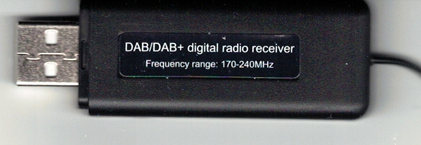
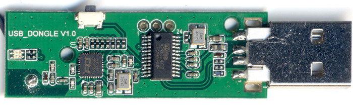
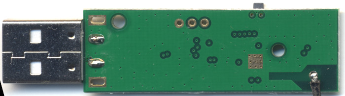

# AP8224 DAB Dongle

**This repository is mainly a collection of information about this dongle**



The AP8224 DAB/DAB+ dongle is a cheap China USB device to receive digital DAB/DAB+ radio. It can be found with different names for example "DAB/DAB + USB-Dongle" at trading platforms e.g. eBay, Amazon or Aliexpress. The dongle provides the audio data via MP3 files on an emulated 172 GB USB drive with the name *MP3DAB*.

It mainly consist of two chips

* MVSILICON AP8224C2 MCU with DSP (http://www.elecfans.com/soft/3/2019/20190610953868.html)

* FCI FC8080 RF tuner and demodulator
  (https://www.dialog-semiconductor.com/products/connectivity/mobile-tv/RF-BB-SoC-T-DMB-FC8080)

## Datasheets
Inside the folder `Datasheets` you can find the public datasheets. The Chinese AP8224C2 is translated via Google translator.

Sources:

* AP8224C2
http://www.elecfans.com/soft/3/2019/20190610953868.html
* FC8080
http://www.siliconmotion.com/download.php?t=U0wyRnpjMlYwY3k4eU1ERXpMekEyTHpJNEwzQnliMlIxWTNRd01qRXhORGswTWpJNExuQmtaajA5UFVaRE9EQTRNRjlpY21sbFpnPT1D%20FC8080

## PCB
High resolution pictures can be found inside the folder `Pictures`.

**Front**



**Back**



## Threads and Videos

* Youtube Video (German): https://www.youtube.com/watch?v=iCf-Ks0hFbI
* German discussion https://www.rundfunkforum.de/viewtopic.php?t=56487&start=30#p1507573

## Files
| File Name | Meaning |
| --- | ---|
| StationName.mp3| Audio stream MP3 coded |
| DAB_BER.TXT | Unknown. In my case a file with zeros |
| DAB_DLS.TXT | Dynamic Label (DLS) |
| DAB_IMG.DAT | Some DAB data. More investigations necessary. |
| DAB_SCAN.CTL | Most likely scan when opening file |
| DAB_UPD.CTL | Unknown action when opening file |
| DAB_VER.TXT | Most likely firmware version |


## Hacking
This is an unsorted list of observations

* When opening or reading a *.CTL file then an actions is performed

* Press the button and plug in the dongle. The dongle will detected as *DAB_UPDATE* USB drive with the following content

```
-rw-r--r-- 1 albrecht albrecht      14 Apr  1  2019 Bootloader_Ver.txt
-rw-r--r-- 1 albrecht albrecht 8388608 Apr  1  2019 FIRMWARE.BIN
-rw-r--r-- 1 albrecht albrecht     512 Apr  1  2019 Readme.txt
-rw-r--r-- 1 albrecht albrecht 2097152 Apr  1  2019 Update_Done.ctl
```

* dmesg output

```
[49793.545497] usb 2-2: new full-speed USB device number 4 using xhci_hcd
[49793.706311] usb 2-2: New USB device found, idVendor=1234, idProduct=1111, bcdDevice= 1.00
[49793.706316] usb 2-2: New USB device strings: Mfr=1, Product=2, SerialNumber=3
[49793.706319] usb 2-2: Product: mvsiicon 026 usb audio
[49793.706322] usb 2-2: Manufacturer: MVSILICON
[49793.706325] usb 2-2: SerialNumber: 20151012
[49793.730735] usb-storage 2-2:1.0: USB Mass Storage device detected
[49793.730878] scsi host3: usb-storage 2-2:1.0
[49793.731018] usbcore: registered new interface driver usb-storage
[49793.733865] usbcore: registered new interface driver uas
[49794.740444] scsi 3:0:0:0: Direct-Access     WRADIO   DAB Stick        V1.0 PQ: 0 ANSI: 2
[49794.741641] sd 3:0:0:0: Attached scsi generic sg2 type 0
[49794.744371] sd 3:0:0:0: [sdc] 335544320 512-byte logical blocks: (172 GB/160 GiB)
[49794.746299] sd 3:0:0:0: [sdc] Write Protect is off
[49794.746302] sd 3:0:0:0: [sdc] Mode Sense: 0b 00 00 08
[49794.748310] sd 3:0:0:0: [sdc] No Caching mode page found
[49794.748315] sd 3:0:0:0: [sdc] Assuming drive cache: write through
[49794.765896]  sdc:
[49794.781305] sd 3:0:0:0: [sdc] Attached SCSI removable disk
```

* Programming most likely via SWD 
https://www.silabs.com/community/mcu/32-bit/knowledge-base.entry.html/2014/10/21/serial_wire_debugs-
* The MVSILICON website http://www.mvsilicon.com/ doesn't provide any  information about the AP8224C2 itself but they provide source code samples, videos and PDF for similar chips

## Helping
**Please send a pull request of you have more information that you will share**